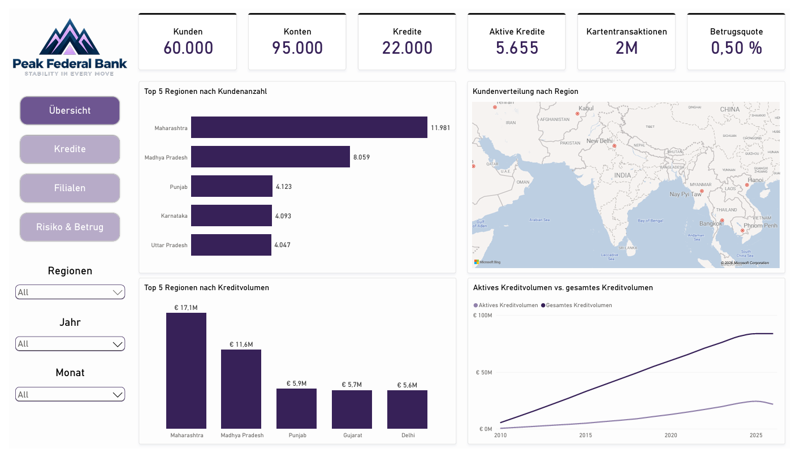

# Banking Analytics - Power BI Case Study (#05)

###### Diese Case Study wurde vollständig in **Power BI** entwickelt und verwendet einen **synthetischen, zufällig generierten Bankdatensatz** von Kaggle, der keine reale Bank repräsentiert.

## Zusammenfassung:

Mit **Power Query** habe ich die Daten bereinigt und für die Analyse aufbereitet, bevor ich das **semantische Modell** in der **Modellansicht** erstellt habe. Anschließend habe ich die erforderlichen Beziehungen und Kardinalitäten zwischen den Tabellen definiert, die benötigten **DAX-Measures** erstellt und einen interaktiven Power BI Report mit vier Seiten entwickelt: **Overview, Loan Performance, Branch Performance und Risk & Fraud**.

Der Report stellt wichtige Bankkennzahlen und Trends dar, darunter:

1. **Kreditperformance und Trends**
2. **Filialperformance und Kunden**
3. **Risiko- und Betrugsanalyse**

###### Das fertige Projekt ist vollständig funktionsfähig, verknüpft und getestet und kombiniert **Datenaufbereitung, Datenmodellierung, Visualisierung und Analyse** entsprechend den zentralen **PL-300-Kompetenzen**.

## Zielsetzung:

Ziel dieses Projekts ist es, die Gesamtperformance der Bank in den Bereichen Kreditportfolio, Filialen und finanzielle Risiken zu analysieren. Dabei liegt der Fokus darauf, die Entwicklung des Kreditportfolios zu verstehen, leistungsstarke und leistungsschwächere Filialen zu identifizieren und die wichtigsten Bereiche finanzieller Risiken für die Bank zu bestimmen. Ziel ist es, Erkenntnisse zu gewinnen, die bessere Geschäftsentscheidungen unterstützen können.

**Zentrale Fragen:**

1. **Wie entwickelt sich das Kreditportfolio?**
2. **Welche Filialen erzielen die beste Performance und wo ist die Performance schwächer?**
3. **In welchen Bereichen liegen die größten finanziellen Risiken der Bank?**

## Methodik:

1. **Daten mit Power Query bereinigen, transformieren und für die Analyse aufbereiten**
2. **Ein semantisches Datenmodell in Power BI erstellen und DAX-Measures für die Analyse von Krediten, Filialen und Risiken entwickeln**
3. **Einen interaktiven Power BI Report erstellen, um wichtige Kennzahlen, Trends und Erkenntnisse zu visualisieren**

## Power BI Skills:

**Power Query:** Datenbereinigung & Datentransformation  
**Datenmodellierung:** Beziehungen, Kardinalitäten & Filter  
**DAX:** Measures, berechnete Spalten & berechnete Tabellen  
**Visualisierung:** Diagramme, KPI-Karten, Tooltips & visuelle Berechnungen  
**Analyse:** KPI-Analyse, Trendanalyse & Entwicklung interaktiver Reports  

## Ergebnisse & Geschäftsempfehlungen:

Dieser Report bietet Stakeholdern einen interaktiven Überblick über das **Kreditportfolio, die Filialperformance sowie Risiko- und Betrugsindikatoren** der Bank. Durch die Zusammenführung dieser Bereiche in einem einzigen Report lassen sich wichtige KPIs leichter überwachen, Trends erkennen und die Performance über verschiedene Jahre und Standorte hinweg vergleichen, ohne auf separate manuelle Analysen angewiesen zu sein.

Die Analyse hat mehrere wichtige Erkenntnisse hervorgebracht:

* **Kreditperformance:** Die Analyse zeigt **5.655 aktive Kredite** mit einem Gesamtbetrag von **21,6 Mio. €**. Die **NPL-Quote von 10,5 %** zeigt, dass ungefähr **1 von 10 Krediten nicht wie erwartet bedient wird**.
* **Filialperformance:** Die Analyse zeigt **150 Filialen, 1.800 Mitarbeiter und 60.000 Kunden**. **Maharashtra** sticht mit der höchsten **Kundenanzahl (11,9 Tsd.)** und dem höchsten **Kreditvolumen (17,1 Mio. €)** hervor.
* **Risiko & Betrug:** Die Analyse identifizierte **14.954 betrügerische Transaktionen**, wobei die Händlerkategorie **Entertainment** mit **18,9 Tsd. €** den höchsten finanziellen Schaden aufweist. Die finanziellen Verluste in den anderen Händlerkategorien lagen jedoch ebenfalls **relativ nah beieinander**, was darauf hindeutet, dass das Betrugsrisiko nicht auf eine einzelne Kategorie konzentriert war.

Auf Grundlage dieser Ergebnisse empfehle ich folgende Maßnahmen:

1. **Notleidende Kredite überwachen:** Bei einer **NPL-Quote von 10,5 %** sollte die Bank notleidende Kredite eng überwachen und potenzielle Kreditrisiken frühzeitig erkennen.
2. **Filialperformance und Ressourcenverteilung überprüfen:** Da **Maharashtra** die höchste Kundenanzahl und das höchste Kreditvolumen aufweist, sollte die Bank die Performance der Filialen überprüfen und sicherstellen, dass Ressourcen effektiv auf die einzelnen Filialen verteilt werden.
3. **Betrugsüberwachung über alle Händlerkategorien hinweg stärken:** Da die durch Betrug verursachten Verluste in den verschiedenen Händlerkategorien relativ ähnlich sind, sollte die Bank eine konsistente Betrugsüberwachung über alle Kategorien hinweg sicherstellen, anstatt sich ausschließlich auf die Kategorie Entertainment zu konzentrieren.

Ich bin der Meinung, dass diese Empfehlungen dazu beitragen können, potenzielle Kreditrisiken zu reduzieren, die Ressourcenverteilung über die Filialen zu verbessern und die Betrugsüberwachung über verschiedene Händlerkategorien hinweg zu stärken.

## Nächste Schritte:

1. **Kredit- und Risiko-KPIs regelmäßig überwachen**
2. **Kredite mit hohem Risiko und verdächtige Transaktionen untersuchen**
3. **Filialressourcen auf Grundlage der Performance-Erkenntnisse optimieren**
